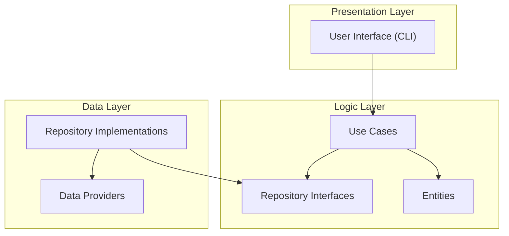

# Plan-Mate

[](https://deepwiki.com/Tokyo-Squad/Plan-Mate)

# PlanMate

A command-line task management application built with Kotlin that follows SOLID principles and Test-Driven Development.

## Overview

PlanMate is a task management system that allows users to create and manage projects, tasks, and their states. The
application supports different user roles (admin and mate) with varying permissions, and includes an audit system to
track changes.

## Features

- **User Management**
  - Two user types: admin and mate
  - Secure password storage with MD5 hashing
  - User authentication

- **Project Management**
  - Create, edit, and delete projects (admin only)
  - Associate tasks with specific projects
  - Multiple projects support

- **Task Management**
  - Create, edit, and delete tasks
  - Assign tasks to specific projects
  - Track task status through customizable states

- **State Management**
  - Dynamic states for each project (not hardcoded)
  - Create and edit states (admin only)

- **Swimlane View**
  - Display tasks organized by their states in a console-based swimlane UI

- **Audit System**
  - Track all changes to projects and tasks
  - View change history by project ID or task ID
  - Record who made changes and when

## Architecture

PlanMate follows a clean, layered architecture:



* **Presentation Layer**: Command-line interface for user interaction
* **Logic Layer**: Business rules, use cases, and domain entities
* **Data Layer**: Data access and storage implementations
  The architecture follows dependency inversion principles, making it easy to switch between data storage solutions.

## Version History

### Version 1.0

- CSV-based data storage
- Synchronous operations

### Version 2.0

- MongoDB-based data storage
- Asynchronous operations with Kotlin Coroutines
- Improved error handling with exceptions

## Technologies

- Kotlin 2.1.10
- Koin 4.0.2 (Dependency Injection)
- Kotlinx-datetime 0.5.0
- JUnit / JaCoCo (Testing)
- MongoDB (Version 2.0)

## Getting Started

### Prerequisites

- JDK 22 or later
- MongoDB (for Version 2.0)

### Installation

1. Clone the repository

```bash
git clone https://github.com/your-username/plan-mate.git  
cd plan-mate  
```

2. Build the project

```bash
./gradlew build
```

2. Run the application

```bash
./gradlew run
```

## Project Structure

```text
src/  
├── main/  
│   ├── kotlin/  
│   │   ├── data/           # Data layer  
│   │   │   ├── csvfile/    # CSV implementations (v1)  
│   │   │   ├── mongo/      # MongoDB implementations (v2)  
│   │   │   └── repository/ # Repository implementations  
│   │   ├── di/             # Dependency injection  
│   │   ├── entity/         # Domain entities  
│   │   ├── logic/          # Business logic  
│   │   │   └── usecase/    # Use cases  
│   │   ├── presentation/   # UI layer  
│   │   └── utils/          # Utilities  
│   └── resources/  
└── test/  
    └── kotlin/             # Test classes  
```